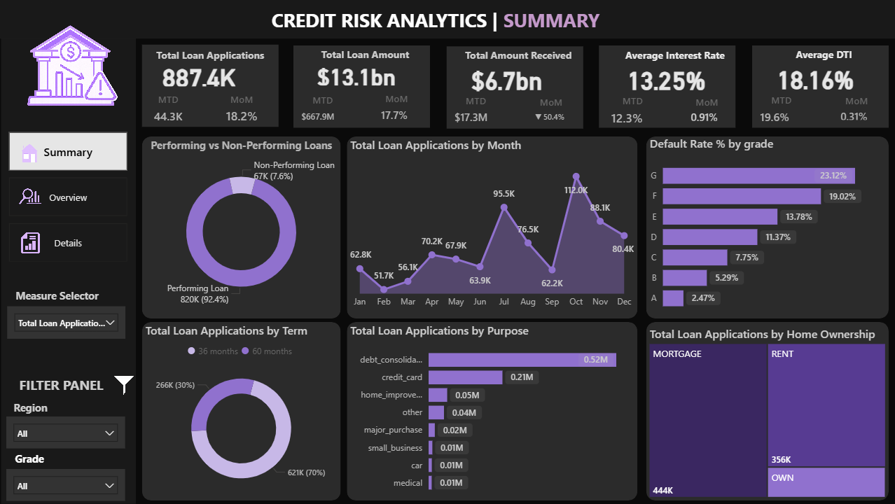
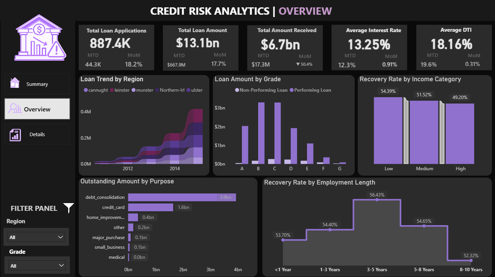
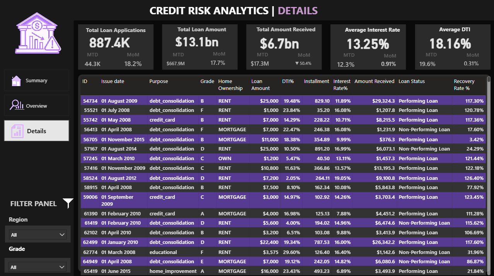

# CREDIT-RISK-ANALYTICS
## Credit Risk Analytics Dashboard

Welcome to **Credit Risk Analytics Dashboard** - an end-to-end Power BI project designed to analyze loan performance, credit risk behaviour, recovery trends, and borrower profiles using interactive visualizations.

This dashboard helps financial institutions monitor loan applications, identify non-performing loans, evaluate recovery performance, and make data-driven lending decisions.

---

## Project Overview

### Domain
Banking & Financial Services

### Problem Statement
Financial institutions often struggle to track loan performance, identify risky borrowers, and monitor recovery efficiency due to scattered reports and manual analysis.

The objective of this project is to create a centralized and interactive dashboard for analyzing:

- Loan performance 
- Default risk
- Recovery trends
- Borrower behavior
- Loan portfolio health

---

## Solution

Developed a multi-page **Power BI Credit Risk Analytics Dashboard** that provides insights into:

- Performing vs Non-Performing Loans
- Loan Applications & Loan Amount Trends
- Recovery Rates
- Default Analysis
- Regional & Purpose-wise Loan Distribution
- Borrower Financial Health Metrics

---

## Objective

To build an interactive dashboard that helps stakeholders:

- Monitor loan portfolio performance
- Identify high-risk loan categories
- Track recovery efficiency
- Analyze borrower demographics and behavior
- Improve strategic lending decisions

---

## Data Sources

Data imported from:

- Excel / CSV Files
- SQL Database (PostgreSQL)
- Power Query transformations

---

## Business Terms Used  

- DTI (Debt-to-Income Ratio)
- Month-to-Date(MTD)
- Month-on-Month(MoM)
- Performing Loan 
- Non-Performing Loan (NPL)
- Recovery Rate
- Default Rate
- Outstanding Loan Amount
- Interest Rate
- Loan Status

---

## Tools & Technologies Used

- Power BI Desktop
- Power Query
- DAX (Data Analysis Expressions)
- MS Excel
- SQL (PostgreSQL)

---

## Dashboard Views

## 1. Summary View

## 2. Overview View

## 3. Details View

---

## Key Learnings from This Project

- Creating interactive Power BI dashboards
- Designing KPI cards
- Performing loan risk analysis
- Building DAX measures and calculated columns
- Data transformation using Power Query
- Developing dynamic slicers and filters
- Creating financial and risk-based visualizations
- Dashboard storytelling

---

## Skills Learned

- Data Visualization
- Financial Analytics
- Credit Risk Analysis
- DAX Calculations
- Power BI Dashboard Design
- Business KPI Analysis
- Data Cleaning & Transformation
- Analytical Thinking
- Report Optimization

---

## Project Outcome

The **Credit Risk Analytics Dashboard** helps to monitor loan portfolio performance, identify risky loan segments, and track recovery efficiency. The dashboard enables faster and more accurate decision-making by transforming complex loan data into actionable business insights through interactive visualizations and KPI tracking.

---

## Author

**Sunali Sadotra** 
Aspiring Data Analyst | Power BI Developer | SQL & Python Enthusiast
